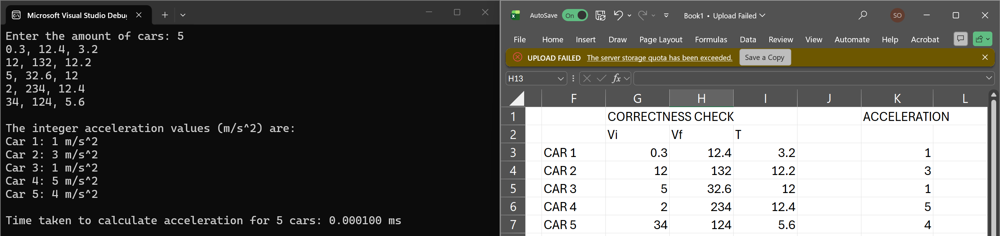

# LBYARCH-MP2

### TODO
- Time the asm function only for input Y size = {10, 100, 1000, 10000}.  If 10000 is impossible, you may reduce it to the point your machine can support. You may use a random number generator to generate values for the input.

- You must run at least 30 times to get the average execution time. 

- For the data, you may initialize each input with the same or different random value. 

- You will need to check the correctness of your output.  

- Output in GitHub (make sure that I can access your Github):

### Average Execution Time 
 Y | 10 | 100 | 1000 | 10000
--- | --- | --- | --- | ---
Average Execution Time (ns) | 103.33 | 520.00 | 3663.33 | 23216.67
Min | 0	| 400 | 2200 | 15300
Max | 200 | 1100 | 8200 | 49900

### Short Analysis of the Performance

## Take a screenshot of the program output with the correctness check.

## Short Videos (5-10mins) showing your source code, compilation, and execution of the C and x86-64 program